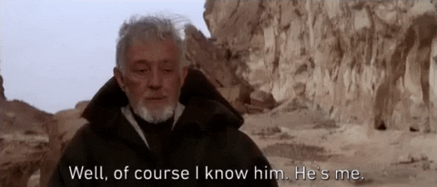
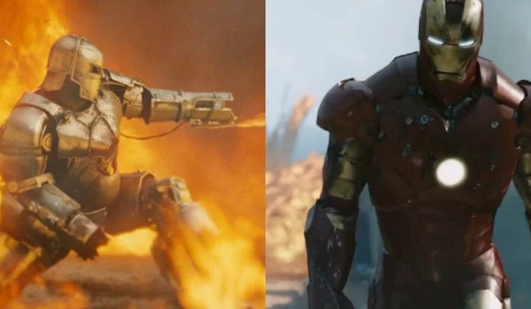
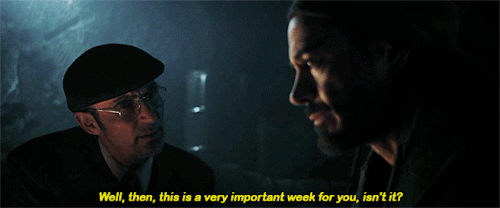
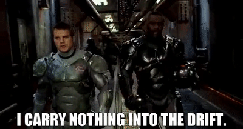
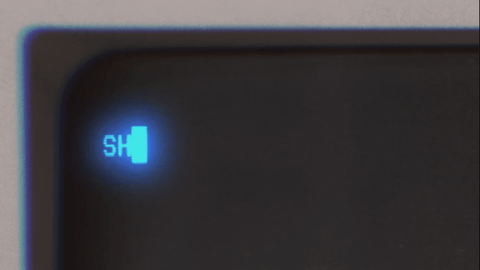
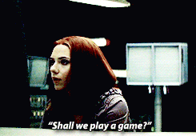

# Writing Sprints

---

* Slides are at https://joereddington.github.io/Slides-2019-10-09-UCLAN/
* This QR code will get you there 

.qr: 450|https://joereddington.github.io/Slides-2019-10-09-UCLAN/#slide1

# Presenter Notes
Thank you everyone for coming. We all have big workloads and I really appreciate you picking out this session and giving me your attention for an hour. I really hope you get a lot out of it.  You can see the slides at that link, feel free to read ahead or go back.

---

# Ego slide

* Dr Joseph Redington 
* I run writing teams.
* I train leaders to run writing teams. 
* 2000 graduates. Over a 100 of them university level.   

--- 
# Things you should already know 

* We're talking about fiction 
* We're talking until 1400. 

--- 

# Goals for Talk
* Everyone who has enrolled in a team writing project knows the rules 
* Everyone who hasn't, wants to. 
* Everyone gets something out of the session in terms of writing productively 
* I make my train 

--- 

# Orientation 

* Part of this session is so that I communicate a mindset you'll need for the writing. So there's a bit of attitude. 

Q What is a good book? 

--- 
# Orientation 

* Part of this session is so that I communicate a mindset you'll need for the writing. So there's a bit of attitude. 

Q What is a good book? 

A One that people buy the sequel to. 

--- 

# What will you do on a writing team? 

* 9-5 for five days. 
* Publish novel. [Everyone claps, Obama is there](https://knowyourmeme.com/memes/and-then-the-whole-bus-clapped). 
* You will be a better writer.    

--- 

# Why will you be better

* Distance 
* Speed 
* Iteration - intense feedback 
* Dropping habits that don't help: procrastination, identities, ego. 

--- 
# How the sprint works

* Preparation 
* Planning (Monday) 
* Drafting (Tuesday/Wednesday) 
* Editing (Thursday/Friday) 
* Followup. 

--- 
# Preparation 

Do nothing 

--- 

# Monday

Turns out the gifs were important...  

--- 

# Monday

* Star Wars
* Frozen
* Lego Movie
* Twilight
* Harry Potter (Film) 
* Iron Man 

--- 

# Goals for Talk
* Everyone who has enrolled in a team writing project knows the rules 
* Everyone who hasn't, wants to. 
* Everyone gets something out of the session in terms of writing productively 
* I make my train 

--- 

# Questions
