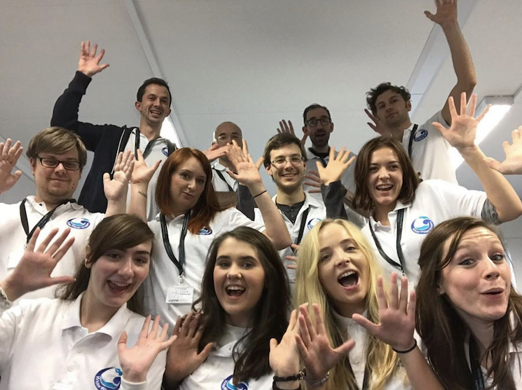

# The Greatest Week of Your Degree

---
# Getting started 

* We're talking until 1400. 
* Slides are at https://joereddington.github.io/Slides-2019-10-09-UCLAN/
* This QR code will get you there 

.qr: 450|https://joereddington.github.io/Slides-2019-10-09-UCLAN/#slide1

# Presenter Notes
Thank you everyone for coming. We all have big workloads and I really appreciate you picking out this session and giving me your attention for an hour. I really hope you get a lot out of it.  You can see the slides at that link, feel free to read ahead or go back.

---

# Start with the thank yous

# Presenter Notes
These guys, Angela 

--- 
# Me

* Dr Joseph Redington 
* I run writing teams.
* I train leaders to run writing teams. 
* 200 Sprints so far. 

--- 
# You 

Victims of the British Educational System 

* Private
* Individual 
* Externally Motivated 
* Fake

# Presenter Notes
I can tell you this with no doubt, if you do this project, you will learn more than any other week here. 

--- 

# Goals for Talk
* Everyone who has enrolled in a team writing project knows the rules 
* Everyone who hasn't, wants to. 
* Everyone gets something out of the session in terms of writing productively 
* I make my train 

--- 

# Goals for a writing sprint 

If you forget everything else... 

* A team of ten work together and publicly release something *real* for everyone to see.
* Given an impossible task: complete, polished novel in five days, 9-5 
* They do something on Friday that they thought was impossible on Monday. 

--- 

# You will be upgraded

* Distance 
* Speed 
* Iteration - intense feedback 
* Dropping habits that don't help: procrastination, identities, ego. 

--- 

# Orientation 

* Part of this session is so that I communicate a mindset you'll need for the writing. So there's a bit of attitude. 

Q What is a good book? 

--- 
# Orientation 

* Part of this session is so that I communicate a mindset you'll need for the writing. So there's a bit of attitude. 

Q What is a good book? 

A One that people buy the sequel to. 

--- 
# How the sprint works

* Preparation 
* Planning (Monday) 
* Drafting (Tuesday/Wednesday) 
* Editing (Thursday/Friday) 
* Followup. 

--- 
# Preparation 

Do nothing 

--- 

# Monday

Turns out the gifs were important...  

--- 

# Monday

Turns out the gifs were important...  

* Find a partner who hasn't seen a film you have! 
* Five minutes! 

--- 

# Monday

Character focus is our major tool 

* Smaller space to think about
* No conflict; no character means no opinion. 
* You don't own the words; not *your* chapter
* Consistency 
* Quality  

By the end of Monday you will have your plot, from your plot you get characters, from your character you get arcs, from your arcs you get scenes, from your scenes you get storyboards

---

# Tuesday

* You are now permitted to type
* Each scene goes through several layers of drafting: the writer of each character in scene takes turns. 
* Writer's block isn't a real thing. 
* There will be a dashboard for keeping track of the process, but you are on your own for the creativity. 

---

# Wednesday

* like Tuesday, but you procrastinated the hard scenes
* Like Tuesday but you now believe you'll do it so they are easier. 
* We expect university students to hit about 80,000 words at the end of Wednesday 
* Day of blood. Not drafted at close of play = deleted. 

--- 

# Thursday & Friday

* Print out
* red pen
* edit
* repeat

1700 Friday you will be done. Signed, sealed, delivered.  Should be on Amazon that night. Signings and so on.   

--- 

# Leaders 

* Mostly useful for people who want to be better writers and who want to stretch themselves. 
* We also run a leadership program, for leaders, to lead.  
* I write a lot of references for that second one. 

--- 

# Leaders 

* Proper work experience: you are give a team of ten, you have a deliverable, a deadline, NO real ability to punish or reward and you have to make it happen. 
* Your team are generally about 12 years old.  
* We train you, DBS check you, drop you in a school with as much support as you need. 
* You also get to, you know, help kids with special needs, or from the care system. Go to Holland. Prison families 
* Technically you can turn it into a job - once people get to a certain point we pay you. One guy has this as a full time job. 

--- 

--- 

# Goals for Talk

* Everyone who has enrolled in a team writing project knows the rules 
* Everyone who hasn't, wants to. 
* Everyone gets something out of the session in terms of writing productively 
* I make my train 

--- 

# Questions
